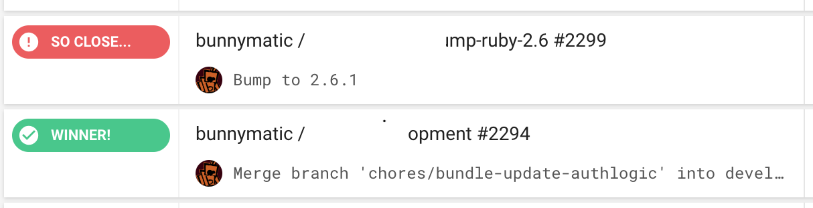

prettify circle ci
=============

Don't you wish CircleCI encouraged you to get better with more positive messages than
`Failed!`.  Do you want your successes to be more full of praise like `You Rule!`?

Look no further.  Install this chrome extension and customize the messaging CircleCI
uses for both successful and failed builds.

## Installing from source

This package has not been distributed to the Chrome Web Store, so to install it:

1. Download the repo and unzip it if necessary.
1. Go to [chrome://extensions/](chrome://extensions/) in your browser.
1. Check `Developer mode`.
1. Click `Load unpacked extension...`
1. Use the file browser to navigate to the `Source` directory under the directory
where the extension was unpacked.
1. Click `Select` or `OK`.
1. You should see a little "C" icon appear in your toolbar, and also at
the top of your list of extensions.

## Configuration

Once the extension is installed, you can click on the extension icon in your
browser's toolbar and choose "Options".  There, you can update the language you
want to see on CircleCI.

After clicking Save, check out your builds on Circle.

### Credits

Originally inspired by [Cloud-to-Butt extension](https://github.com/panicsteve/cloud-to-butt)
